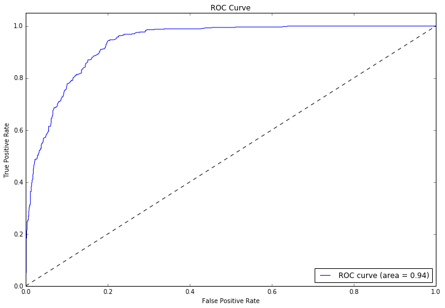

## 1. Data Pre-processing
We work with the dataset from the University of Melbourne for grant applications. The data consists of 249 features. The task is to predict whether the grant will be given to a candidate.

The features can be divided into three groups:

1. The type of the grant, e.g. sponsors, the value of the grant; 
2. The research area, e.g. the RFCD code, the socio-economic objective; 
3. The team members, e.g. the level of seniority, research experience, history of grant applications.

---

```python
# Loading the data
train = pd.read_csv('data.csv')
train.head()

# Separating training features and labels
y = train['Grant.Status']
X = train.drop('Grant.Status', axis=1)
```

---

## 2. Data Cleaning and Feature Engineering

The data cleaning consists of three steps. First, we convert categorical features into indicator features.

```python
X['Sponsor.Code'] = pd.get_dummies(X['Sponsor.Code'], dummy_na=True).values.argmax(1)
```

For the start date, we splitted the date and create new features: day, month, year, weekday, season.

```python
def c_Month(x): return x.split("/")[1]
def c_Year(x): return x.split("/")[2]
def c_Weekday(x):
    d = datetime.datetime(year = int(c_Year(x)), month = int(c_Month(x)), day = int(c_Day(x)))
    return d.weekday()
```

---

To deal with missing values in the numerical features, we replace the NaN with the mean of the features.

```python
imp = Imputer(missing_values='NaN', strategy='mean', axis=0)
imp.fit(X.values)
X_train = imp.transform(X_train)
X_vali = imp.transform(X_vali)
X_test = imp.transform(X_test)
```

---

## 3. Training and Evaluation

We use the accuracy as well as precision, recall, F-measure and ROC AUC.

```python
F1 = 2*(Precision * Recall)/(Precision + Recall)
```

First, we experimented with Random Forest Classifier. Then, we experiment with other learning models: Gradient Boosting, Nearest Neighbors, Decision Tree, AdaBoost, Naive Bayes, Linear Discriminant Analysis, Quadratic Discriminant Analysis.

---

### 3.1 Experiments with Random Forest Classifier

```python
rfc = RandomForestClassifier(max_depth=200, n_estimators=1250)
rfc.fit(X_train, y_train)
print rfc.score(X_vali, y_vali)
print rfc.score(X_test, y_test)
```
Validation and test accuracy:

```python
Validation  87.26%
Test        86.32%
```

Precision and Recall in the Confusion matrix:

Precision | Recall | F1
--------|--------|--------
87%      | 86%   | 86%

---

Receiver operating characteristic (ROC curve) of the Random Forest Classifier. The ROC AUC value is 93.76%.



---

### 3.2 Experiments with Gradient Boosting Classifier

```python
gbm = ensemble.GradientBoostingClassifier(**params)
gbm.fit(X_train, y_train)
print gbm.score(X_vali, y_vali)
print gbm.score(X_test, y_test)
```
Validation and test accuracy:

```python
Validation  88.03%
Test        85.74%
```

Precision and Recall in the Confusion matrix:

Precision | Recall | F1
--------|--------|--------
0.86      | 0.86   | 0.86

---

Receiver operating characteristic (ROC curve) of the Gradient Boosting Classifier. The ROC AUC value is 93.92%


---

### 3.3 Experiments with kernel methods

First, we split the features into three parts:

1. Part 1: Sponsor Code, Grant Category Code, Contract Value Band
2. Part 2: RFCD Code, RFCD Percentage, SEO Code, SEO Percentage
3. Part 3: All the features of 15 people

Then, we compute three different kernels:

```python
K1		Linear kernel of part 1
K2		Linear kernel of part 2
K3		Linear kernel of part 3
```

---

The combined kernel is derived by taking the average of the three kernels:

```python
K = (K1 + K2 + K3)/3
```

Results of the combined kernel on the validation and test set:

 		| Accuracy | F1
--------|--------|--------
Validation	| 67.57% | 52.76%
Test		| 69.88% | 55.93%

---

### 3.4 Experiments with other classifiers

Classifier | Accuracy | F-measure
--------|--------|--------
Nearest Neighbors | 53.95 | 55
Decision Tree | 83.94 | 84 
AdaBoost | 82.85 | 83
Naive Bayes | 63.46 | 50
Linear Discriminant Analysis | 78.36 | 78
Quadratic Discriminant Analysis | 63.26 | 50

---

## 4. Conclusion

We established a first baseline without any feature engineering, afterwards we started several model improvments such as:

1. Adding new features (date-> Day, Month, Year) to the data.
2. Parameterization of classifiers with and without Gridsearch.
3. Employ pipeline models: First we train a model for people, called Team model, then we apply the results on the origin data.
4. Comparision of other classifiers to our Random Forest baseline score.

The best results are derived with Gradient Boosting Classifier, following these steps:

1. Convert from categorical to indicator variables.
2. Convert the date to day, month, year, weekday, and season and add to the origin data.
3. Impute missing values with the mean.
4. Train and test with Gradient Boosting Classifier.

---

## Thank you!

